# KaliMind - Autonomous Vulnerability Assessment Agent


**KaliMind** is an LLM-Assisted Vulnerability Assessment Tool. By leveraging the [Model Context Protocol (MCP)](https://modelcontextprotocol.io/), KaliMind connects the reasoning capabilities of Large Language Models (LLMs like Claude) with the execution power of standard penetration testing tools running on Kali Linux.

---

## 🌟 The Core Concept of KaliMind

Traditional security scanners run scripts and flag potential issues based on rigid signatures, leaving human pentesters to manually verify, chain exploits, and filter out false positives. 

**KaliMind flips this paradigm by turning the LLM into an active, autonomous penetration tester.**

### How It Works
- **LLM-Driven Tool Execution:** KaliMind allows the LLM to read scan results, understand the context, and decide what tool to run next.
  - *Example:* The LLM runs `nmap_scan` and finds port 80 open. It immediately decides to run a `dirb_scan` and `nikto_scan` on that port. It discovers an exposed `/admin` login and a `wp-config.php.bak` file. It then formulates an SSH/FTP attack strategy using `hydra_attack` or spins up `metasploit_run` to exploit a known vulnerability. 
- **Autonomous Task Pipelining:** You can instruct the LLM, *"Assess the target at 192.168.1.100 for any critical open ports,”* and the AI can handle the reconnaissance, enumeration, and validation phases.
- **Context-Aware Exploit Generation:** Because the LLM maintains the entire context of the target environment, it can dynamically adjust payloads, rewrite Wordlists for context-specific brute forcing, or construct complex Metasploit `.rc` scripts on the fly.

---

## 🏗️ End-to-End Architecture & Workflow

KaliMind is split into a robust two-part architecture to ensure the AI's reasoning engine remains cleanly separated from the dangerous execution environment.

```mermaid
graph TD
    %% Define Nodes
    Human(["👤 Human Operator"])
    LLM{{"🧠 LLM / AI Agent <br> (e.g., Claude)"}}
    MCP_Client["🔌 kalimind_mcp.py <br> (Local Machine)"]
    Backend["⚙️ kalimind_backend.py <br> (Kali Linux VM)"]
    pentest_tools["🛠️ OS Security Tools <br> (Nmap, Metasploit, etc.)"]
    Target[("🎯 Target Infrastructure")]
    Report(["📄 Final Pentest Report"])

    %% Define flow
    Human -- "1. Provides Scope & Objective \n(e.g., 'Assess 10.0.0.5')" --> LLM
    
    subgraph Cognitive Loop [Intelligence & Reasoning Loop]
        LLM -- "2. Formulates Strategy & Chooses Tool" --> Action
        Action{Tool Execution}
        Action -- "3. Invokes MCP Tool Format" --> MCP_Client
        
        MCP_Client -- "4. Sends HTTP POST Request" --> Backend
        Backend -- "5. Spawns Asynchronous Shell Process" --> pentest_tools
        
        pentest_tools -- "6. Executes Attack/Scan" --> Target
        Target -. "7. Raw stdout/stderr Results" .-> pentest_tools
        
        pentest_tools -- "8. Captures Execution Output" --> Backend
        Backend -- "9. Returns JSON Response" --> MCP_Client
        MCP_Client -- "10. Feeds Context Back" --> LLM
        
        LLM -- "11. Analyzes Vulnerability Data" --> Decision{Vulnerable?}
        Decision -- "Yes: Exploit/Enumerate Further" --> Action
        Decision -- "No: Try Different Vector" --> Action
    end
    
    Decision -- "12. Assessment Complete" --> Generate
    Generate{Synthesis} -- "13. Compiles Findings" --> Report
    Report -. "14. Delivers Final Output" .-> Human

    %% Styling
    classDef primary fill:#2a9d8f,stroke:#264653,stroke-width:2px,color:#fff;
    classDef secondary fill:#e9c46a,stroke:#e76f51,stroke-width:2px,color:#333;
    classDef backend fill:#e76f51,stroke:#d62828,stroke-width:2px,color:#fff;
    classDef decision fill:#264653,stroke:#2a9d8f,stroke-width:2px,color:#fff;
    
    class LLM primary;
    class Target secondary;
    class Backend backend;
    class pentest_tools backend;
    class MCP_Client primary;
    class Decision decision;
    class Action decision;
```



### 1. `kalimind_backend.py` (The Execution Engine)
- **Environment:** Runs directly inside a Kali Linux environment (VM, Docker container, or bare metal).
- **Role:** Exposes a Flask REST API that takes properly sanitized tool requests and spawns isolated shell subprocesses (`nmap`, `metasploit`, `hydra`, etc.). 
- **Features:** Asynchronous process handling and continuous stdout/stderr tracking. Long-running attacks (like password cracking) won't lock up the thread; they are strictly managed by timeout protocols.

### 2. `kalimind_mcp.py` (The Intelligent Bridge)
- **Environment:** Runs on your local machine alongside the MCP Client (e.g., Claude Desktop application).
- **Role:** Registers the specific pentesting tools with the Model Context Protocol, teaching the LLM exactly *what* tools it has, *what* parameters they accept, and *when* to use them. It translates LLM intent into HTTP REST calls sent to the backend.

---

## 🛠️ Deep Dive into Capabilities

KaliMind gives the LLM access to the following security arsenal:

### 📡 Reconnaissance & Web Scanning
* **`nmap_scan`**: The LLM can dynamically determine which ports to scan, which scripts (`-sC`) to run, and what version enumeration (`-sV`) is required based on the target.
* **`gobuster_scan` & `dirb_scan`**: The LLM autonomously discovers hidden endpoints, API routes, or exposed configuration files, adjusting its wordlists on the fly.
* **`nikto_scan` & `wpscan_analyze`**: The LLM audits web servers and WordPress installations for outdated plugins, CVEs, and known misconfigurations.

### 💥 Exploitation & Vulnerability Assessment
* **`sqlmap_scan`**: The LLM can pass vulnerable parameters it previously discovered straight into SQLMap to attempt automatic database takeover.
* **`metasploit_run`**: The LLM can search for an exploit module, set the required `RHOSTS`, `LHOST`, and payload options, and trigger headless Metasploit execution, feeding the exploitation output back into its context.

### 🔓 Enumeration & Cracking
* **`enum4linux_scan`**: Automatically enumerates Windows environments, SMB shares, and user lists.
* **`hydra_attack` & `john_crack`**: If the LLM discovers password hashes or exposed login portals, it can autonomously mount dictionary attacks or brute force mechanisms against them.

### ⚙️ Absolute Control
* **`execute_command`**: The fallback superpower. If the LLM needs a tool that isn't explicitly wrapped (like `curl`, `jq`, `netcat`, or custom Python scripts), it can simply execute raw shell commands on the Kali machine.

---

## 📦 Prerequisites

1. **Python 3.x** on both the Kali Backend and the Client Machine.
2. A machine running Kali Linux (or a system with the required security tools installed in the `$PATH`).
3. **Pip packages** (`requirements.txt`):
   - `Flask>=3.0.0`
   - `requests>=2.31.0`
   - `mcp>=1.0.0`
4. Network connectivity between the machine running the MCP client and the Kali backend server.

---

## 🚀 Setup & Deployment

### Step 1: Install Dependencies
Install the required packages on both your Kali backend and your local client machine:
```bash
pip install -r requirements.txt
```

### Step 2: Spin up the Execution Engine
On your Kali Linux machine, start the backend API server. This server will wait for commands from your LLM.

```bash
# To run locally on the Kali Machine:
python3 kalimind_backend.py

# To expose the server to your local network (so a separate machine can connect):
python3 kalimind_backend.py --ip 0.0.0.0 --port 5000 --debug
```
*You can verify it is active by navigating to `http://<KALI_IP>:5000/health`.*

### Step 3: Link the AI (Configuring Claude Desktop)
To give Claude access to these powers, configure your MCP settings.

1. Open the Claude Desktop configuration file:
   - **macOS**: `~/Library/Application Support/Claude/claude_desktop_config.json`
   - **Windows**: `%APPDATA%\Claude\claude_desktop_config.json`
2. Add the `kalimind-server` configuration:

```json
{
  "mcpServers": {
    "kalimind-server": {
      "command": "python3",
      "args": [
        "C:\\absolute\\path\\to\\KaliMind\\kalimind_mcp.py", 
        "--server", 
        "http://<KALI_IP>:5000/"
      ],
      "timeout": 300
    }
  }
}
```
*Note: Ensure the absolute path to `kalimind_mcp.py` is correct and replace `<KALI_IP>` with the network IP of your Kali machine.*

3. **Restart Claude Desktop.** You can now type, *"Do a full vulnerability sweep of 192.168.1.50"* and watch the AI take over.

---

## 🛡️ Critical Security Warnings

**DO NOT EXPOSE THE KALI API SERVER TO THE INTERNET.**

* **Arbitrary Code Execution**: The `/api/command` endpoint explicitly accepts arbitrary terminal commands.
* **No Authentication**: The API currently has no authentication layer. Anyone who can reach `http://<KALI_MACHINES_IP>:5000` essentially has root/user-level shell access to that machine.
* **Safe Architecture Guidelines**:
  * Run the Kali Backend in a strict Host-Only or NAT network VM.
  * Use SSH Tunneling to forward port 5000 securely if running on cloud infrastructure.
  * Never bind to `0.0.0.0` on a public-facing VPS.

---

## ⚠️ Disclaimer & Legal Notice

**KaliMind is built for educational, research, and authorized professional security testing purposes only.**

Testing infrastructure, attempting to exploit vulnerabilities, or running enumeration tools against targets without prior, explicit, and mutual consent is illegal and strictly prohibited. The creators, maintainers, and contributors of this project assume zero liability for any misuse, damage, or legal repercussions caused by utilizing this tool. By using KaliMind, you agree that you are solely responsible for compliance with all applicable local, state, and international laws.
